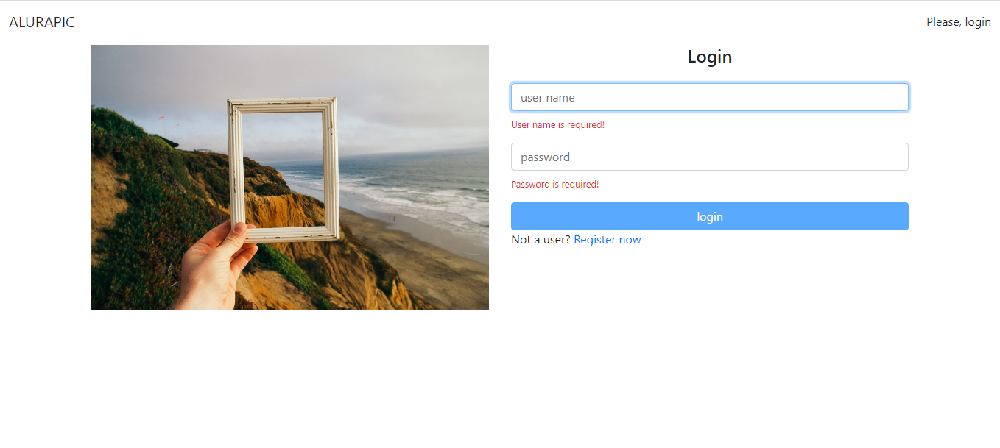
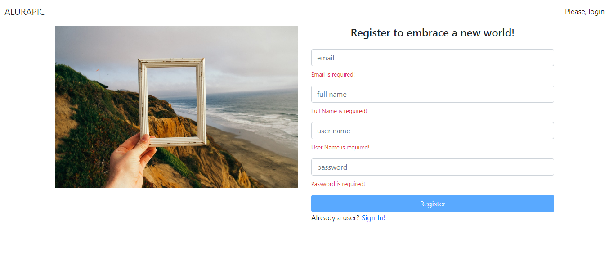
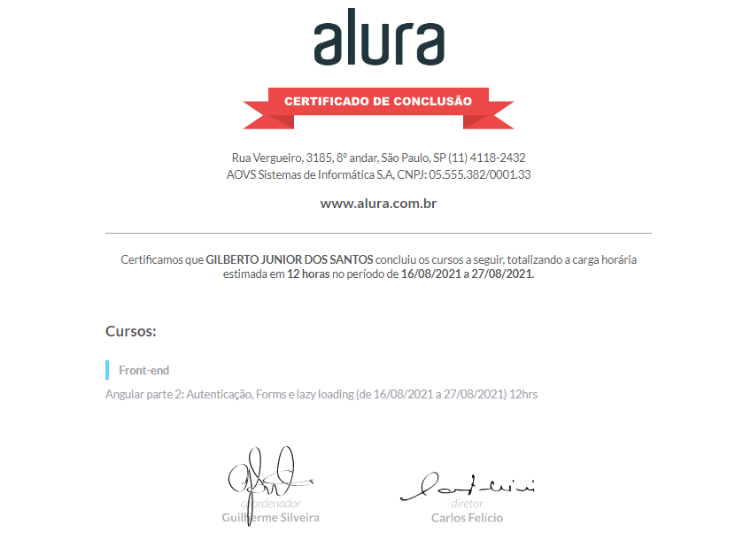

#  Angular: Autenticação, Forms e lazy loading

Nesse curso criamos o componente para login. O component de login Validação de formulários Componentizando mensagens de validação. Enviando credenciais para a API Redirecionamento pós login ViewChild: obetendo referências do template. Detectando a plataforma de execução

Foi desenvolvido em Angular com o `typeScript`.

Para criar o Front-End 

### Dependência.

```javascript    
    "@angular/animations": "^6.0.3",
    "@angular/common": "^6.0.3",
    "@angular/compiler": "^6.0.3",
    "@angular/core": "^6.0.3",
    "@angular/forms": "^6.0.3",
    "@angular/http": "^6.0.3",
    "@angular/platform-browser": "^6.0.3",
    "@angular/platform-browser-dynamic": "^6.0.3",
    "@angular/router": "^6.0.3",
    "bootstrap": "^4.1.1",
    "core-js": "^2.5.4",
    "font-awesome": "^4.7.0",
    "jwt-decode": "2.2.0",
    "rxjs": "^6.0.0",
    "zone.js": "^0.8.26",
    "typescript": "^2.7.0"
```

### Dependência de Desenvolvimento.

```javascript    
    "@angular-devkit/build-angular": "~0.6.6",
    "@angular/cli": "~6.0.7",
    "@angular/compiler-cli": "^6.0.3",
    "@angular/language-service": "^6.0.3",
    "@types/jasmine": "~2.8.6",
    "@types/jasminewd2": "~2.0.3",
    "@types/jwt-decode": "^3.1.0",
    "@types/node": "~8.9.4",
    "codelyzer": "~4.2.1",
    "jasmine-core": "~2.99.1",
    "jasmine-spec-reporter": "~4.2.1",
    "karma": "~1.7.1",
    "karma-chrome-launcher": "~2.2.0",
    "karma-coverage-istanbul-reporter": "~2.0.0",
    "karma-jasmine": "~1.1.1",
    "karma-jasmine-html-reporter": "^0.2.2",
    "protractor": "~5.3.0",
    "ts-node": "~5.0.1",
    "tslint": "~5.9.1"
```

# ScreenShot

## Página - Login
<p align="center">

</p>

## Página - Registrar
<p align="center">

</p>


# CERTIFICADO


<p align="center">

</p>
<h1 align="center">💻 Desenvolvido Por: Gilberto Júnior</h1>
